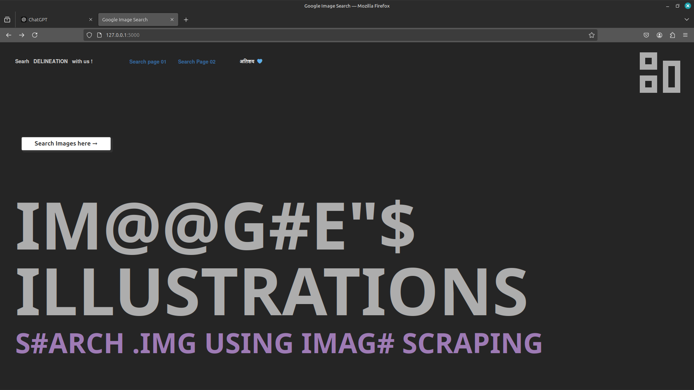
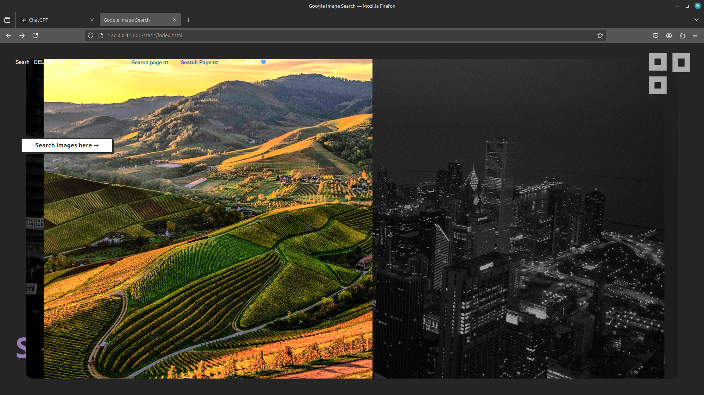
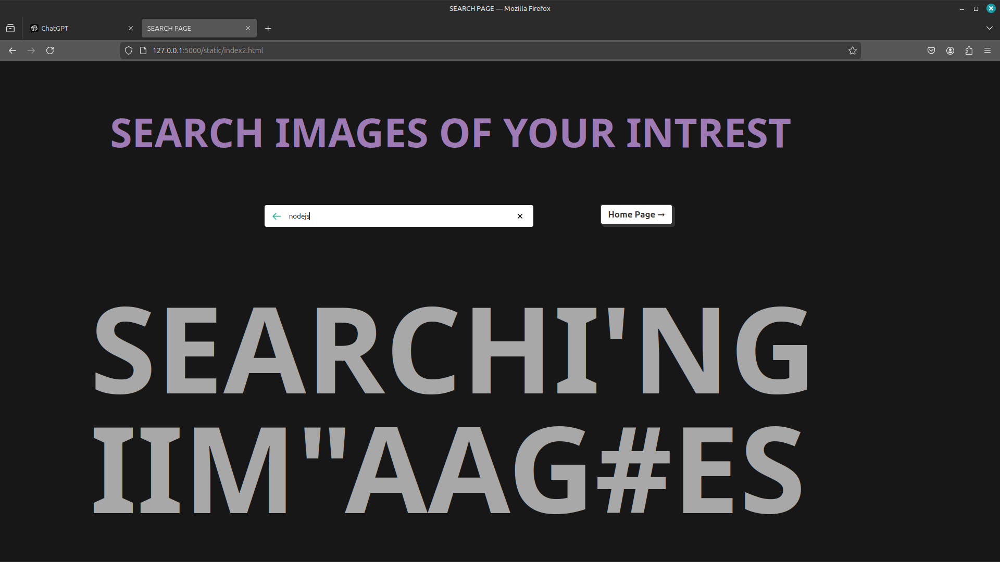
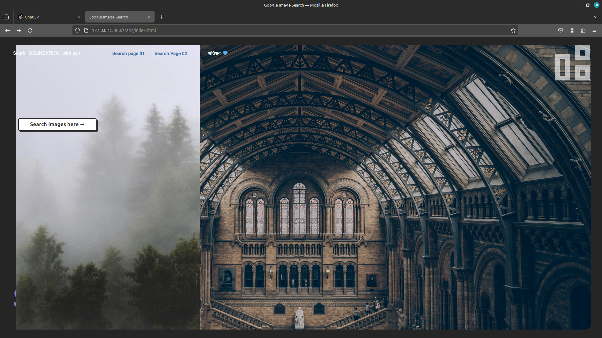
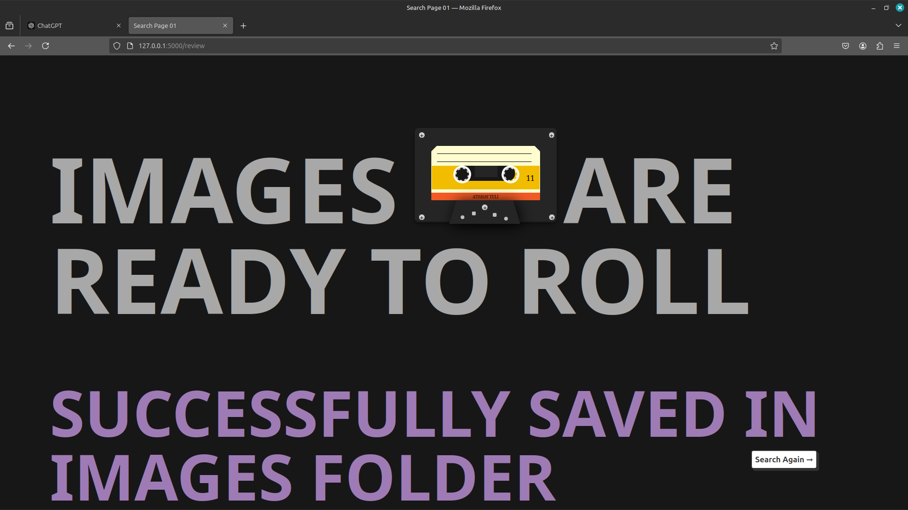
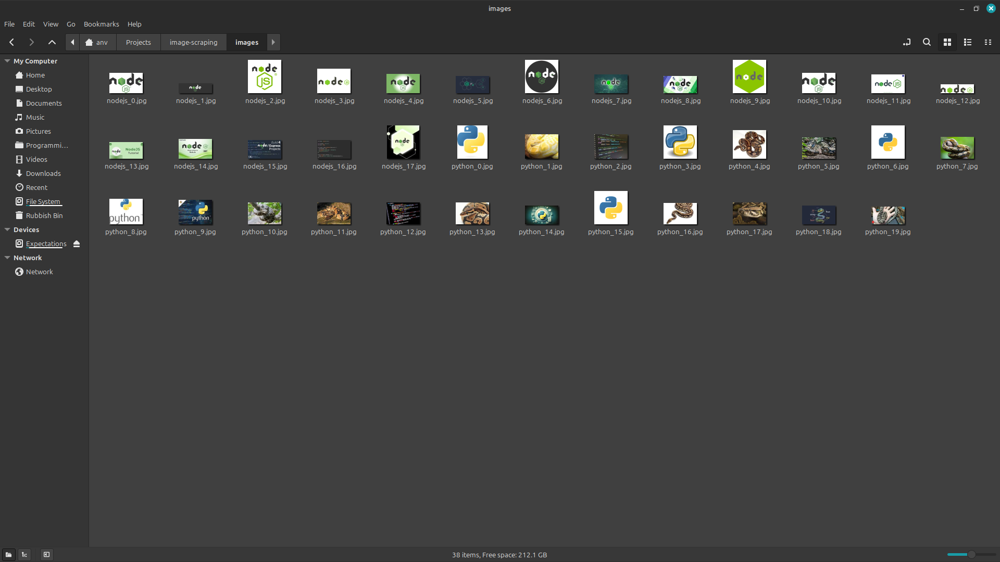
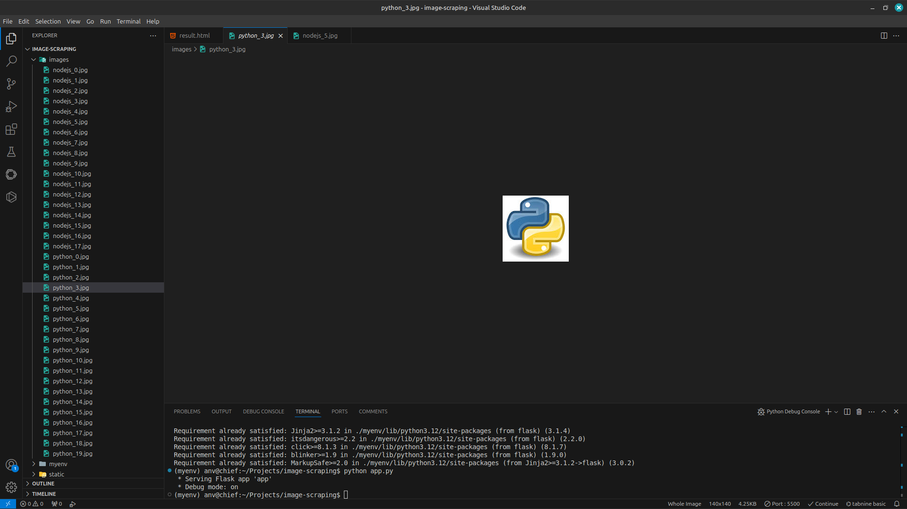

# Image Scraping Tool 🖼️

## Description

The **Image Scraping Tool** is a simple web application built with **HTML**, **CSS**, **JavaScript**, and **Python** (using Flask). It allows users to search for images based on a keyword, scrape 20 image results from the web using **BeautifulSoup**, and display or download the results directly into your IMAGES Folder.

This tool is ideal for developers or researchers who need to gather images for training datasets, design inspiration, or other purposes. It leverages web scraping techniques and organizes the downloaded images in a structured format.

## Features

- User-friendly interface built with HTML, CSS, and JavaScript.
- Backend powered by Python and Flask for seamless server-side operations.
- Scrapes images from the web using **BeautifulSoup**.
- Downloads and stores scraped images in a local directory.
- Displays scraped images in the browser for easy preview.

---










## Technologies Used

- **Frontend**: HTML, CSS, JavaScript
- **Backend**: Python (Flask Framework)
- **Web Scraping**: BeautifulSoup
- **Data Handling**: Python's `os` module and `requests` library
- **Database** (optional): Integration-ready with MongoDB for logging or data persistence.

---

## How to Run the Project

### Prerequisites

- **Python 3.6+** installed on your system.
- Basic knowledge of terminal/command line.
- Install the required Python libraries:
  ```bash
  pip install flask flask-cors requests beautifulsoup4 pymongo

#### STEP 01 : Clone this repository
git clone <repository-url>
cd image-scraping-tool

#### STEP 02: Set up a virtual environment (optional but recommended)
python3 -m venv myenv
source myenv/bin/activate  # On Windows, use myenv\Scripts\activate

#### STEP 03: Ensure the project folder has the following structure
image-scraping-tool/
├── app.py
├── templates/
│   ├── index.html
│   ├── result.html
├── static/
│   ├── images/ (this folder will be created automatically)
├── scrapper.log
├── IS01.png to IS07.png

#### STEP 04: Run the Flask application
```bash
  python app.py

